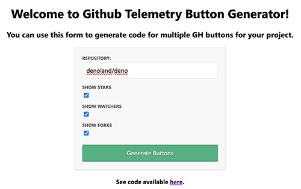

# GitHub Telemetry Buttons Generator

## Overview

This app helps users to quickly generate GitHub buttons representing the repo's telemetry:
    * Stars
    * Watchers
    * Forks

## Example
For [Deno GH project](https://github.com/denoland/deno), you can choose to show a button for Stars, Watchers and Forks:



The app can produce the following code:

```<iframe src="https://ghbtns.com/github-btn.html?user=denoland&repo=deno&type=star&count=true" frameborder="0" scrolling="0" width="150" height="20" title="GitHub"></iframe><iframe src="https://ghbtns.com/github-btn.html?user=denoland&repo=deno&type=watch&count=true&v=2" frameborder="0" scrolling="0" width="150" height="20" title="GitHub"></iframe><iframe src="https://ghbtns.com/github-btn.html?user=denoland&repo=deno&type=fork&count=true" frameborder="0" scrolling="0" width="150" height="20" title="GitHub"></iframe>```

Then, you can paste this code into your README.md and see the following:


## How to Use

1) Go to a [Heroku instance of the app](https://gh-telemetry-buttons.herokuapp.com/)

2) Enter repo name following a format: [ORG_NAME/REPO_NAME]. To illustrate, for "https://github.com/nodejs/node" only enter *"nodejs/node"*

3) Choose what buttons you want to generate:
    * Stars
    * Watchers
    * Forks

4) After pressing "Generate Buttons", copy-paste the HTML code for your buttons into your site/docs. 

## Running Locally

To run the app locally:

1) Clone the repo:
```git clone git@github.com:dmitryvinn/gh-telemetry-buttons.git```

2) In the project's directory, install ```npm``` packages
```npm install```

3) Run the app:
```npm start```

5) Go to ```http://localhost:5000/```

## Miscellaneous

## Why building this
I've been working on a project where I wanted a quick way to generate the primary GH metrics to copy-paste into my markdown. I figured others might have the same use-case; hence, I decided to put this simple app together.

### Inspiration 
The project is based on [Mark Otto](https://github.com/mdo)'s work with the [Unofficial GitHub Buttons](https://github.com/mdo/github-buttons). 

